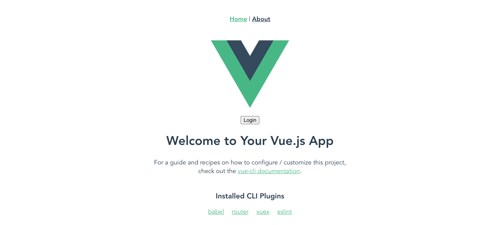

# Auth0-Vue-SpringBoot-Kotlin-Frontend
Implementation of [Auth0 Blog Post](https://auth0.com/blog/vuejs-spring-boot-kotlin-and-graphql-building-modern-apps-part-1/) by Vladimir Fomene

This repo just contains the frontend. The associated frontend that calls the API can be found [here](https://github.com/egconley/Auth0-Vue-SpringBoot-Kotlin-Backend/tree/master).

## Run on localhost
1. Clone this repo down to your local machine.
2. Add credentials:
    - create a .env file in the root folder of the project and add the following environment variables:
    - `Auth0-API-IDENTIFIER=your.auth0.api.identifer.associated.with.the.backend`
    - `VUE_APP_SECRET_DOMAIN=your-auth0-tenant.auth0.com`
    - `VUE_APP_SECRET_CLIENT_ID=your-auth0-client-id-for-this-app`
    - `VUE_APP_SECRET_AUDIENCE=http://the.backend.url.associated.with.the.api` example: `http://localhost:8888`
3. Run `npm run serve` from the command line.
4. If running the api from localhost, be sure to follow the instructions [here](https://github.com/egconley/Auth0-Vue-SpringBoot-Kotlin-Backend/tree/master).
5. Open `http://localhost:8080/` in your browser.

## Deploying
1. Follow steps 1 and 2 above.
2. If deploying to Heroku, add the following buildpacks:
    - `heroku/nodejs`
    - `https://github.com/heroku/heroku-buildpack-static`
3. To Heroku, add the the environment variables above under config variables.
    
## Screenshots

